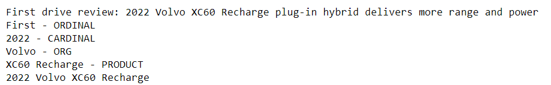
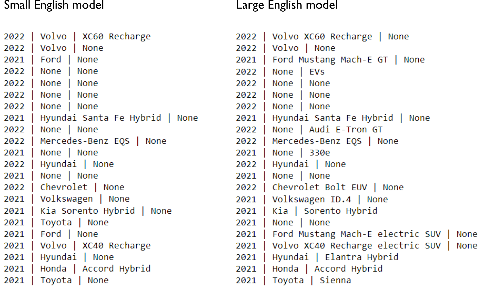
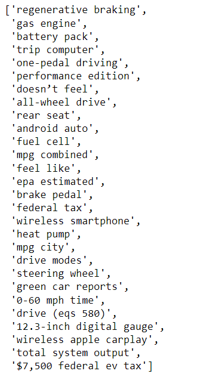
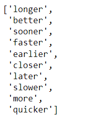
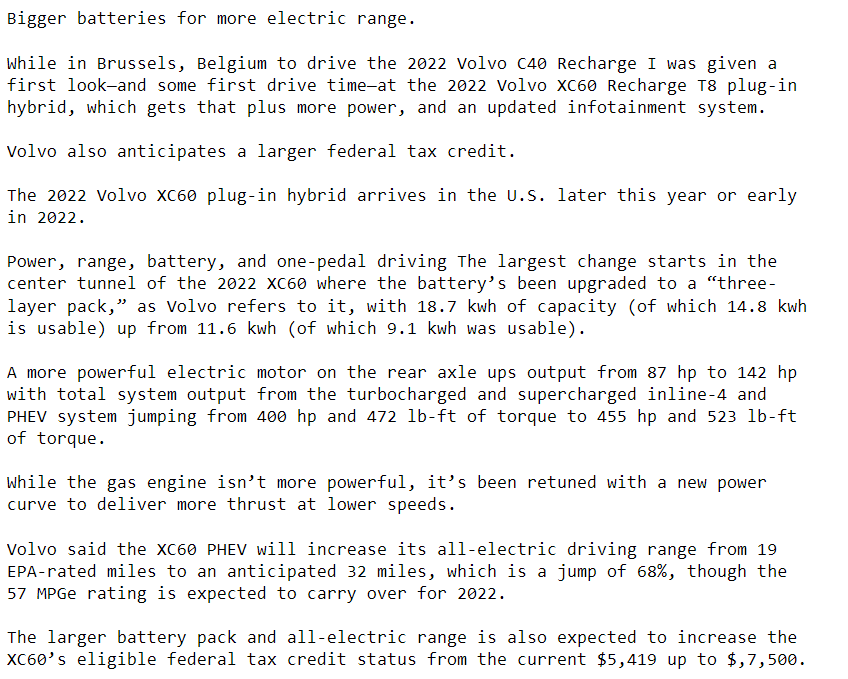

## Gaining insight from reviews of new electric vehicle models 

President Biden recently announced an ambitious target for 50% of all new vehicles sold to be zero-emissions vehicles by 2030. In order to achieve such widespread adoption of green cars, it is necessary to understand consumer choices and priorities in electric and hybrid vehicle purchases, and to use these insights to inform design decisions for the next generation of vehicles. I scraped car reviews from [Green Car Reports](http://www.greencarreports.com) to gather relevant text for a list of car models and performed natural language processing on it to extract informative excerpts.

### Identifying vehicles from review titles

I extracted the links for the reviews from the homepage using the Beautiful Soup library and put them into a list. For the first step, I tried to collect identifiers (consisting of model year, make, and model name tuples) for the cars from the title of the reviews, using natural language processing (NLP) tools from the Spacy and NLTK libraries. After extracting the year, I used named entity recognition to try to detect car makes and models and tested it on the first review page.

```
import requests
from bs4 import BeautifulSoup
import spacy

nlp = spacy.load('en_core_web_sm')
URL2 = 'https://www.greencarreports.com/news/1133945_first-drive-review-2022-volvo-xc60-recharge-plug-in-hybrid-delivers-more-range-and-power'
page2 = requests.get(URL2)
soup2 = BeautifulSoup(page2.content,'html.parser')
results2 = soup2.find(class_='article-title')
title = results2.get_text()

year = re.findall("20\d\d", title)
year = int(year[0])

sen = nlp(title)
named_ents = sen.ents
car_make = None
car_model = None

for entity in named_ents:
    print(entity.text + ' - ' + entity.label_)
    if entity.label_== 'ORG':
        car_make = entity.text
    elif entity.label_ == 'PRODUCT':
        car_model = entity.text

print(year, car_make, car_model)
```


Pretty impressive for a freely available tool!

At this point, I was feeling optimistic and excited, but when I ran the code over the entire list of reviews, I immediately ran into issues. For the “Lucid Air”, neither “Lucid” nor “Air” were identified as named entities (a reason to pick searchable and non-generic names, but then no one is criticizing the MacBook Air). For the “Polestar 2”, it was initially unclear to me what the correct answer should be – was “2” the model name, and how could named entity analysis identify that? What about all the variants following the model name, such as “single-motor,” “dual-motor,” “hybrid,” “plug-in hybrid”? 

The first strategy to improve things was to try a larger language model (i.e., going from ‘en_core_web_sm’ to ‘en_core_web_lg’). The latter was almost 800 MB and took 2 min to download, but these may be acceptable since this is not a real-time application with a massive amount of data. The large model was able to pick up a larger number of the models as ‘PRODUCT’ entities, but because those often included the make of the vehicle, we often lost identification of the make as an ‘ORG’ entity. Furthermore, this effect was inconsistent and unpredictable. For instance, “Santa Fe Hybrid” was labeled as an ‘ORG’ entity. This appears to be a nesting / overlapping span problem. I also tested the NLTK library, but it tagged the “Hyundai Santa Fe Hybrid” as a ‘PERSON’ entity and “SUVs” as an ‘ORG’ entity. 



For this particular website, the vehicle make was typically the first token after the model year (I checked that “Mercedes-Benz” tokenizes as one word). Simply taking the first token performed great in comparison. Then, I looked for either ‘ORG’ or ‘PRODUCT’ entities in the title that were not equal to the vehicle make, which were presumably the model names, and removed the vehicle make if it was nested within.

For the time being, I decided to consider variants such as “hybrid” versus “plug-in hybrid” a part of the model name. To extract the full model name in this case, I used parallelism patterns in the article titles on this website and experiment with part of speech (POS) tagging. Typically, a verb agreeing with a singular subject followed the model name, e.g., “2022 Hyundai Ioniq 5 plugs into new wave…” However, POS detection is a hard problem due to ambiguous words that can act as, say, nouns or verbs, depending on the context. For instance, NLTK labeled the word “shines” as a plural noun, while Spacy labeled “trades” as a plural noun. The latter seems subjectively like a more probabilistically reasonable error. In both cases though the label in context should have been “VBZ” (Verb 3rd person singular present form). I instructed the program to try Spacy first, and then NLTK secondarily if Spacy could not find the VBZ in the title.    


Next, I added custom named entities as needed. There are a limited number of carmakers and car types so this seemed feasible and relatively accurate but labor-intensive option. To minimize the work, I detected likely vehicle makes from the previous part that were not recognized as named entities by Spacy and requested a human check on this list. It made sense to add these via a rule-based approach rather than a model-training approach. Lastly, I manually corrected the model from "Lucid EVs" to "Lucid Air" ("EVs" was labeled a 'PRODUCT' entity). 

```
car_makes_unknown2 = {x for x in car_makes_unknown 
                      if not((len(nlp(x).ents)>0) and 
                             (nlp(x).ents[0].label_=='ORG'))}

print("Suggested car makes to add to NER:")
print(car_makes_unknown2)
```


```
ruler = nlp.add_pipe("entity_ruler")
for cm in list(car_makes_unknown2):
    ruler.add_patterns([{"label": 'ORG', "pattern": cm}])
```
At this point, it performed fairly well on the list of car reviews we had.

Other ideas I considered but didn’t implement:

1)	 This approach was particular to this website’s title pattern. To create a more generalizable solution for vehicle model identification, it may make sense to work off of a list or table of cars scraped from another source, if such a comprehensive list could be obtained.   

2)	 Look for the pattern in the text of the review article itself – e.g., the car model may appear as the most frequent capitalized word(s). However, there may not be enough quantity of data here.

3)	 Particular contexts are likely to surround the name of car models (e.g., “The all new…”). Using known car names, we can find those contexts, perhaps by training a neural network, and then use those contexts to find more car names. Perhaps doing so in an iterative manner could help build a large set of car names. 

### Detecting key terms and extracting information related to those terms

For the second part of the project, I wanted to extract key information about what properties of the cars were important to the reviewers. After excluding stopwords and car model words, keywords were created by looking at:

1)	 Most common combinations of adjacent words (bigrams, trigrams, and four-grams). These were combined into a single list, after removing bigrams that were subsets of trigrams, etc.



2)	 Most common singular single-word nouns (excluding words that were components of n-gram combinations): 

  

(As you can see, common words were not necessarily informative, such as “vehicle”)

3)	 Top 20 comparative adjectives:


(Daft Punk?!)

4)	 Top 10 comparative adverbs:



5)	 Words associated with positive or negative sentiment (according to [Bing Liu’s Opinion Lexicon](https://www.cs.uic.edu/~liub/FBS/sentiment-analysis.html)).

I then excerpted sentences that contained any of the above terms to produce a summary:



Alternatively, I could pull out the immediate context (e.g., preceding and following 5 tokens) of some of the terms (e.g., top bigrams) to read, or for further analysis:


